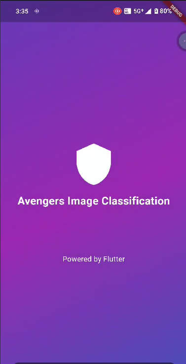
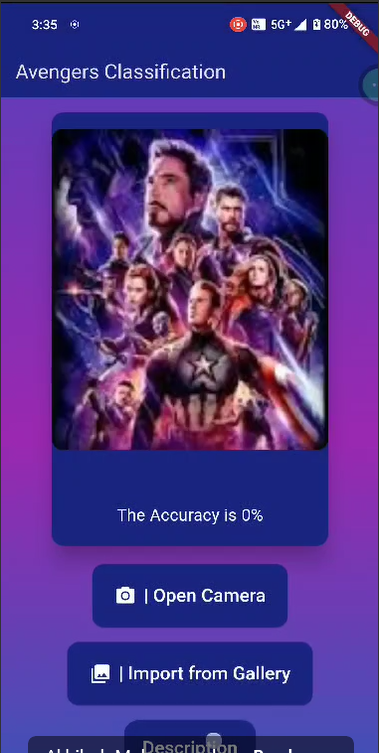

# clubproject

A new Flutter project.

# Avengers Image Classification

This Flutter project is an Avengers image classification app that uses TensorFlow Lite to classify Avengers characters based on images provided by the user. Users can either take a photo using the camera or select an image from their gallery for classification.

## Features

- Splash screen with a loading animation
- Main screen to capture or select an image
- Classification of Avengers characters using a pre-trained TensorFlow Lite model
- Display of classification results including label and confidence score
- Description modal providing information about the app

## Getting Started

### Prerequisites

- Flutter SDK: `>=3.4.0 <4.0.0`
- Dart SDK

### Installation

1. **Clone the repository:**

   ```bash
   git clone https://github.com/Akhilesh-Mohanasundaram/clubproject.git
   cd clubproject
   ```

2. **Install dependencies:**

   ```bash
   flutter pub get
   ```

3. **Ensure you have the required assets:**

   - `assets/model.tflite` - The TensorFlow Lite model file.
   - `assets/labels.txt` - The labels file for the model.
   - `assets/upload.jpeg` - A placeholder image for the upload area.

4. **Run the app:**

   ```bash
   flutter run
   ```

## Usage

1. **Splash Screen:**
   - The app starts with a splash screen displaying the app name and logo.
   - Automatically navigates to the main screen after a short delay.

2. **Main Screen:**
   - Capture an image using the camera or select an image from the gallery using the provided buttons.
   - The app will process the image and display the classification results including the predicted label and confidence score.

3. **Description:**
   - Press the "Description" button to open a modal with information about the app.

## Dependencies

- `flutter`: Flutter SDK
- `image_picker`: For picking images from the gallery or camera
- `flutter_tflite`: For running the TensorFlow Lite model
- `cupertino_icons`: For iOS style icons

## Project Structure

- **lib/main.dart**: The main file containing the UI and functionality for image classification.
- **assets/**: Directory containing the TensorFlow Lite model, labels file, and placeholder image.

## Screenshots

### Splash Screen


### Main Screen


## License

This project is licensed under the MIT License - see the [LICENSE](LICENSE) file for details.

## Acknowledgements

- Flutter
- TensorFlow Lite
- Image Picker

## Contact

For any inquiries or issues, please contact [akhileshmohan2005@gmail.com].
